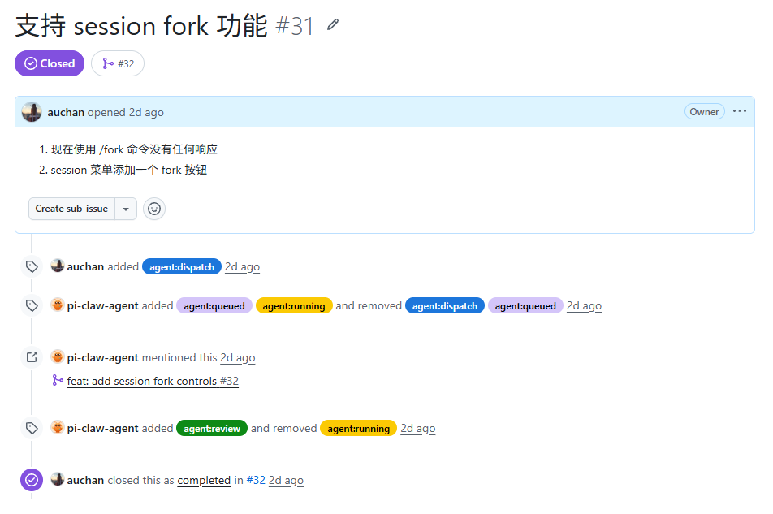

# Pi on Code

[English](README.md) | 简体中文

Pi on Code 是面向 VS Code 的 Pi 原生编程智能体（coding-agent）扩展。它把 Pi 的会话（Session）、Package 生态、扩展运行时与智能体工作流带到了一流的编辑器工作区中，而不是包装成普通的聊天界面。

它结合了持久化的多会话对话、丰富的流式工具输出、Package 与扩展管理，以及对 VS Code 代码智能的直接访问。界面遵循 Pi 紧凑的终端风格视觉语言，同时支持深色与浅色主题。

## 截图

### 深色主题


### 浅色主题


## 功能特性

- 在 VS Code 中运行真实的 Pi 智能体会话，同时保持与 Pi 标准设置、Packages 和 JSONL 会话文件的兼容性。
- 在多个持久化会话之间工作，每个会话拥有独立的模型与思考级别；可从活动栏恢复、切换或删除会话。
- 以紧凑的对话视图流式展示智能体文本、思考过程、工具调用、Shell 输出、文件预览与差异（diff）。
- 支持转向（Steer）当前回合或排队（Queue）后续问题，并可编辑、重排、提升后续消息。
- 无需离开侧边栏即可安装与更新 Pi Packages、预览市场媒体、启用或禁用会话扩展。
- 直接在对话中渲染扩展提问与 UI 交互。
- 让 Pi 访问编辑器诊断、符号、定义、引用、工作区编辑、打开的标签页等 VS Code 原生上下文。
- 无需额外对话头部即可跟踪模型、思考、effort、上下文用量、活动扩展与智能体活动。

## Issue 驱动的开发



如果你有**新需求**或**发现了 Bug**，直接在 [GitHub Issues](https://github.com/auchan/pi-on-code/issues) 中提交 Issue 即可：

- **描述需求**：说明你希望新增的功能或改进。
- **报告 Bug**：描述复现步骤、期望行为与实际行为。

仓库中的 **pi-claw agent** 会自动读取你的 Issue，分析需求或定位 Bug，并在独立分支中自动完成开发或修复，随后提交 Pull Request。你只需在 Issue 中把需求或问题描述清楚，剩下的开发和修复工作会自动进行。

## 安装

从 Visual Studio Marketplace 安装 **Pi on Code**，或运行：

```powershell
code --install-extension auchan.pion-code
```

该扩展会恢复上次关闭 VS Code 时打开的 Pi 会话标签页；当没有可恢复的标签页时，不会自动打开新的聊天标签页。

## 环境要求

- VS Code 1.118 或更高版本。
- Node.js 22 或更高版本。
- Pi coding agent 0.80.8 至 0.85.1（当前已验证的兼容范围）。

Pi 0.80.8 是支持的最低版本，因为 Pi on Code 使用了 [Pi 0.80.8](https://pi.dev/news/releases/0.80.8) 引入的 `ModelRuntime` 驱动 SDK。所需的 Session、Extension Runner、Package Manager 与 Settings API 已在 Pi 0.85.1 上验证。上游变更请参见 [Pi 发布说明](https://pi.dev/news)。

全局安装最新兼容的 Pi 版本：

```powershell
npm install -g --ignore-scripts @earendil-works/pi-coding-agent@0.85.1
```

先在终端中完成 Pi 认证，运行 `Pi: Set Up API Key / Login`，或从命令面板使用 `Pi: Set Anthropic API Key` / `Pi: Set OpenAI API Key`。通过这些命令输入的 API 密钥存储在 VS Code SecretStorage 中。

## 使用方法

1. 在 VS Code 中打开一个受信任的文件夹。
2. 打开 Pi on Code 活动栏视图，或运行 `Pi: Code Agent`（`Ctrl+Alt+I`）。
3. 输入请求并按回车。

Pi 聊天输入框内的快捷键：

- `Enter`：转向或发送
- `Alt+Enter`：排队后续问题
- `Ctrl+L`：选择模型
- `Ctrl+P`：循环切换常用模型
- `Ctrl+/`：命令选择器

只有 `Ctrl+Alt+I` 被注册为 VS Code 全局快捷键，因此 Pi on Code 不会替换标准编辑器绑定（如 Quick Open 或 Toggle Line Comment）。

## 安全与隐私

Pi on Code 是一个智能体扩展：当你批准或请求工作时，Pi 可以读取和修改工作区文件并执行 Shell 命令。因此该扩展在受限模式（Restricted Mode）下被禁用，并且需要一个受信任、非虚拟的工作区。使用前请审阅 `AGENTS.md` 等项目上下文文件，因为 Pi 会将其作为指令加载。

提示词、附加的编辑器内容与工具结果会由 Pi 发送给你配置的模型提供商，其处理方式受该提供商的条款与隐私政策约束。Pi on Code 自身不添加遥测，也不发送使用分析数据。通过 Pi on Code 输入的提供商 API 密钥存储在 VS Code SecretStorage 中，而不是 `settings.json`；使用 `Pi: Clear Stored API Keys` 可移除它们。

安全或功能问题请通过 [GitHub Issue 追踪器](https://github.com/auchan/pi-on-code/issues) 报告。不要在报告中包含 API 密钥、会话记录或专有源代码。

## 开发

```powershell
bun install
bun run compile
bun run build
bun run install:vsix
```

`bun run build` 会检查类型与 Lint、创建生产 bundles，并写入 `artifacts/pion-code-<version>.vsix`。`bun run install:vsix` 会把生成的包强制安装到 VS Code。在 VS Code 中按 F5 启动扩展开发宿主（Extension Development Host）。

## 发布

发布完全由 CI 驱动——无需本地发布步骤。

1. 将 `chore/release-<version>` 的 PR 合并到 `main`（它会更新 `package.json`、manifest 测试与 `CHANGELOG.md`）。功能和修复 PR 应使用 `Closes #<issue>` 或 `Fixes #<issue>` 关联 Issue，以便发布工作流自动感谢 Issue 提交者。
2. 为合并提交打标签并推送：

   ```powershell
   git tag -a v<version> -m "Release <version>"
   git push origin v<version>
   ```

3. `release.yml` 工作流随后会自动构建 VSIX、运行集成测试、生成包含关联 Issue 提交者致谢的发布说明、发布到 VS Code Marketplace 并创建 GitHub Release。

发布时不要在本地运行 `bun scripts/publish-vsix.mjs` 或 `gh release create`：CI 管线负责这两个步骤，本地发布会与之冲突（例如当标签已存在手动创建的 Release 时，工作流的发布创建会失败）。

## 架构

[](media/architecture.svg)

## 致谢

SDK 生命周期、会话持久化、VS Code 桥接工具、事件转换、Webview 协议与打包管线均改编自 [Pi Code Gui](https://github.com/NimbleTronAI/pi-code-gui)。Pi on Code 引入了自己的产品标识、多会话工作区、集成的 Package 与扩展体验，以及面向浅色/深色主题的 Pi 风格视觉系统。

继承的实现基于 MIT 许可证发布。保留原始版权声明，Pi on Code 的贡献在相同许可证下分发。请参阅仓库根目录的 `LICENSE` 文件。
